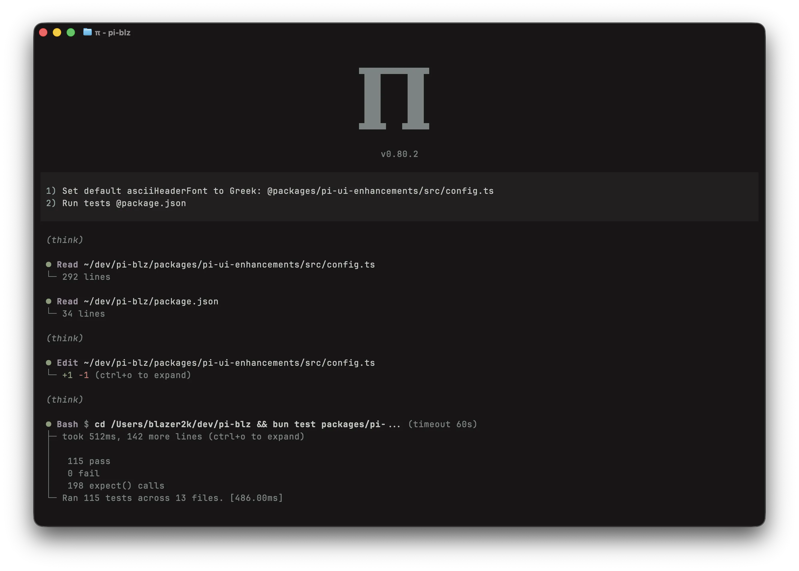
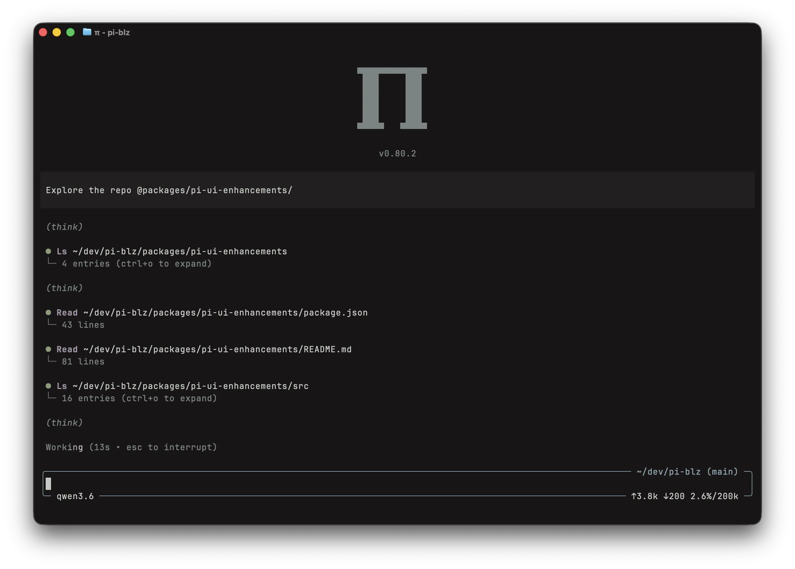

# @blazer2k/pi-ui-enhancements

Visual polish and compact tool rendering for [pi](https://pi.dev).

**Current version:** 0.1.0

## Overview

This extension adds visual improvements to pi's TUI:

- Configurable ASCII art header at session start, rendered via figlet or the bundled Greek pi fonts.
- Rounded border around the editor showing cwd, git branch, model, token usage, and context percentage.
- Shimmer animation on the "Working" label with elapsed duration and an interrupt hint.
- Compact tree-drawing summaries for tool output instead of verbose raw output. Paths are hyperlinked when your terminal supports it. Third-party tools get wrapped too (see below).
- Optional capitalization for custom tool call labels, enabled by default.





## Installation

```bash
pi install npm:@blazer2k/pi-ui-enhancements
```

Or install locally for development:

```bash
git clone https://github.com/blazer2k/pi-blz.git
cd pi-blz
npm install
pi -e ./packages/pi-ui-enhancements/src/index.ts
```

## Configuration

Run `/ui` in pi to open the settings menu.

### Available Settings

| Setting                | Description                                                                        |
| ---------------------- | ---------------------------------------------------------------------------------- |
| Enable ASCII header    | Show ASCII art header at session start                                             |
| Header font            | Font for ASCII art header (19 figlet fonts + 2 bundled, default: Greek)           |
| Header color           | Theme color of ASCII header (text, accent, dim)                                    |
| Header alignment       | Horizontal alignment (left, center, right)                                         |
| Show version           | Display pi version below ASCII header                                              |
| Show interrupt hint    | Show "esc to interrupt" next to the working indicator                              |
| Show run duration      | Show elapsed time while working, toast on completion                               |
| Patched built-in tools | Which built-in tool renderers to replace (essential or all)                        |
| Patch custom tools     | Apply compact rendering to third-party tools                                       |
| Capitalize tool names  | Capitalize custom tool call labels (default: true, e.g. search → Search)           |
| Max call width         | Maximum width for tool call and output lines                                       |
| Max expanded entries   | Maximum lines when expanding tool output (-1 for unlimited), doesn't apply to bash |
| Editor border color    | How the editor border is colored (thinking, dim, muted)                            |
| Show thinking level    | Display thinking level in editor footer                                            |
| Show cache tokens      | Display cache read/write token counts                                              |
| Show cost              | Display total session cost in editor footer                                        |
| Show git branch        | Display current git branch in editor header                                        |

### Built-in Tool Patches

The `patchedBuiltInTools` setting has two modes:

- **essential** (default): read, write, edit, bash
- **all**: adds ls, find, grep

Changes here require `/reload` since tool renderers are registered at load time. Everything else applies immediately.

### Third-Party Tool Monkey-Patching

By default, the extension monkey-patches `ExtensionRunner.prototype.getAllRegisteredTools` to intercept third-party tool definitions and wrap their output in the same compact format. Built-in tools and tools with `renderShell: "self"` are left alone.

Custom tool call labels are capitalized by default while preserving the tool's own `renderCall()` layout when possible. For example, `mcp` becomes `Mcp`.

If you prefer third-party tools to render natively, disable `patchCustomTools` in the settings menu. If you prefer lowercase custom tool labels, disable `capitalizeToolNames`.

## Persistence

Settings are saved to `~/.pi/agent/ui-settings.json` and restored on each session. Override the path with `PI_UI_ENHANCEMENTS_CONFIG_PATH`.

## License

MIT
