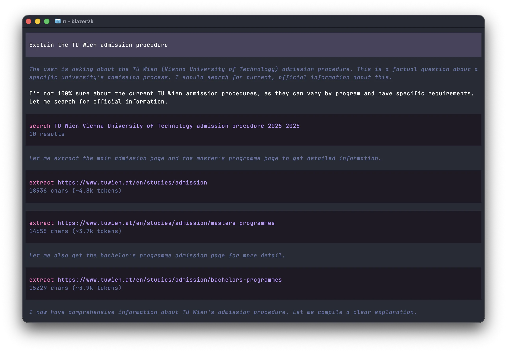
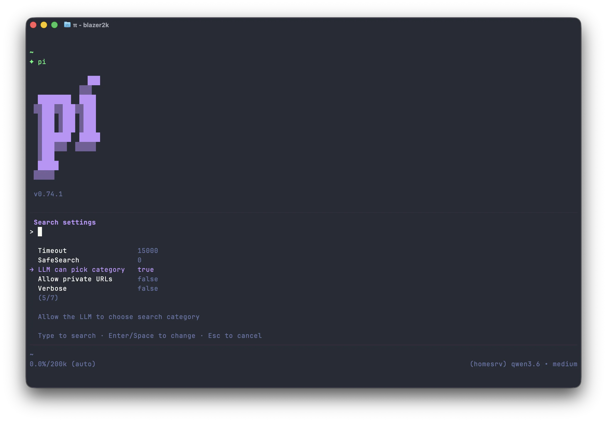

# @blazer2k/searxng-suite

SearxNG-based web search with category filtering and multi-format URL extraction for [pi](https://pi.dev).

**Current version:** 0.2.4 · [Changelog](CHANGELOG.md)

## Overview

This extension provides two LLM-callable tools:

- **`web_search`:** Search the web via your SearxNG instance with configurable result limits, timeouts, SafeSearch, and optional rich metadata (direct image URLs, thumbnails, resolution, etc.).
- **`web_extract`:** Extract content from any URL, supporting multiple formats:

| Format     | Output                                                                              |
| ---------- | ----------------------------------------------------------------------------------- |
| HTML       | Denoised, converted to Markdown with metadata (title, author, date, description)    |
| Plain text | Raw text with source info                                                           |
| PDF        | Text extracted per page with headers and separators (text-native PDFs only, no OCR) |
| Images     | Attached with metadata (format, size)                                               |



## Requirements

- **Node.js 20+** (extensions run via jiti)
- A running [SearxNG](https://searxng.org) instance (local or remote)

## Installation

```bash
pi install npm:@blazer2k/searxng-suite
```

Or install locally for development:

```bash
git clone https://github.com/blazer2k/pi-blz.git
cd pi-blz
npm install
pi -e ./packages/searxng-suite/src/index.ts
```

## Configuration

### Environment Variables

| Variable          | Default                 | Description                              |
| ----------------- | ----------------------- | ---------------------------------------- |
| `SEARXNG_URL`     | `http://localhost:8888` | Base URL of your SearxNG instance        |
| `SEARXNG_API_KEY` | _(none)_                | Bearer token for authenticated instances |

These must be available to the process running pi – set them in your shell profile, systemd service, or however you launch pi.

### Runtime Settings

Run `/search-config` in pi to adjust settings at runtime:

| Setting                | Options                           | Description                                                            |
| ---------------------- | --------------------------------- | ---------------------------------------------------------------------- |
| Results limit          | 1, 5, 10, 15, 20                  | Maximum results per search                                             |
| LLM can override limit | false, true                       | Allow the LLM to request fewer results per search                      |
| Timeout                | 5s, 10s, 15s, 30s                 | Request timeout                                                        |
| SafeSearch             | 0 (off), 1 (moderate), 2 (strict) | Filter explicit content                                                |
| LLM can pick category  | false, true                       | Allow the LLM to choose a search category                              |
| Allow private URLs     | false, true                       | Allow requests to localhost and private IP ranges (`web_extract` only) |
| Verbose                | false, true                       | Show full results instead of compact summary                           |

Settings persist to `~/.pi/agent/pi-searxng-suite.json`.

> **Note:** Changes to **LLM can override limit** and **LLM can pick category** require `/reload` to take effect, as they alter the tool schema presented to the LLM. Other settings (limit, timeout, SafeSearch, etc.) apply immediately.



## Search Categories

When **LLM can pick category** is enabled, the LLM can target searches to specific SearxNG categories:

| Category       | Use case                               |
| -------------- | -------------------------------------- |
| `general`      | Default – searches all enabled engines |
| `images`       | Image search                           |
| `videos`       | Video search                           |
| `news`         | News articles                          |
| `it`           | IT and programming                     |
| `science`      | Scientific papers and articles         |
| `files`        | File downloads                         |
| `social media` | Social media posts                     |

The LLM receives the category list in the tool description and picks the best match for each query.

## Rich Metadata (`includeMetadata`)

By default, `web_search` returns the standard fields: `title`, `url`, `content`, and `engine`.  When you pass **`includeMetadata: true`**, each result also includes any available SearxNG metadata fields:

| Field             | Description                                    | Typical in       |
| ----------------- | ---------------------------------------------- | ---------------- |
| `img_src`         | Direct URL to the full-size image file         | `images` search  |
| `thumbnail_src`   | URL to a small preview thumbnail               | `images` search  |
| `resolution`      | Image dimensions (e.g. `1920 x 1329`)          | `images` search  |
| `img_format`      | MIME type (e.g. `image/jpeg`)                  | `images` search  |
| `filesize`        | File size (e.g. `5.74 MB`)                     | `images` search  |
| `source`          | Originating site and file size                 | various engines  |
| `author`          | Photographer or content author                 | Flickr, etc.     |

This is especially useful for **image searches** where you need the direct image URL (`img_src`) rather than the HTML source page (`url`).

```text
web_search({ query: "ducks", category: "images", includeMetadata: true })
```

Example output with metadata:

```
## **1.** mallard ducks feel in love!!
**URL:** https://www.flickr.com/photos/55514420@N00/4433930955
**Image URL:** https://live.staticflickr.com/2785/4433930955_f0de8a0cd1.jpg
**Resolution:** 500 x 375
**Source:** User @ Flickr
```

## Security

- Private IP ranges (localhost, 10.x, 127.x, 192.168.x, 172.16–31.x) are blocked by default for `web_extract`.
- Content size limits prevent oversized downloads (2 MB HTML, 1 MB text, 50 MB PDF/images).
- All search and extract results are flagged as untrusted content in the LLM context.

## License

MIT – see [LICENSE](LICENSE)
